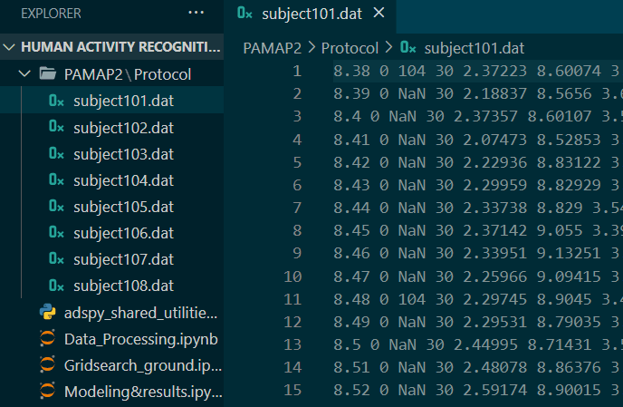
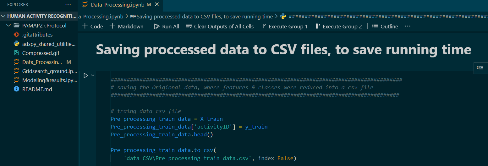

## **Human Activity Recognition**
In numerous healthcare applications, activity Recognition is a critical duty. It is feasible to provide automatic suggestions to both patients and physicians by continually monitoring and analyzing user behavior.
___
## **Description**
Our project aims to determine whether we can use fewer sensors to acquire useful information, what machine learning model might be deployed, and what should be done to improve our classifiers' performance.
___
## **Requirements**
- [**Sklearn**](https://scikit-learn.org/stable/install.html) (The sklearn library contains a lot of efficient tools for machine learning)

___
## **Table Of Contents**
- [**Human Activity Recognition**](#human-activity-recognition)
- [**Description**](#description)
- [**Requirements**](#requirements)
- [**Table Of Contents**](#table-of-contents)
- [**Data**](#data)
    - [**PAMAP2**](#pamap2)
- [**Pre-Processing**](#pre-processing)
- [**Guideline**](#guideline)
- [**Results**](#results)
- [**Report**](#report)
- [**Future Work**](#future-work)
- [**Contributing**](#contributing)

___
## **Data**
#### **[PAMAP2](https://archive.ics.uci.edu/ml/datasets/PAMAP2+Physical+Activity+Monitoring)** 
The PAMAP2 Physical Activity Monitoring Dataset is an ML dataset from the UCI repository that contains data from 18 different physical activities conducted by 9 participants while wearing three inertial measurement units and a heart rate monitor. 
___

## **Pre-Processing**
* Only 4 activities were chosen to predict from.
* Because the ninth subject did not participate in any of the activities we picked, only eight participants' data were used instead of nine.
* Optional data were ignored.

___
## **Guideline**  

1. You must first donwload PAMAP2 data.
1. Create a new directory. 
   >Your_project_file\PAMAM2\protocol 
1. Put the data subjects 0 through 8 into the directory.
2. Make a row in each of the Subjects files as shown below.
3. To be efficient with such massive data, we will just read it once, alter it, and store it as new CSV files.
4. so another directory will be created
    >Your_project_file\data_CSV 

    
5. You may now work with your processed data and test your models without having to read anything else. 
   > **warning:**
   > If any preprocessing happened, CSV files must be recreated.

___

## **Results**

- Testing on just **4 Activities** we achivied decent results even with Logistic regression model

- We recommend  using  a Logistic model on a normalized data sample to effectively make a prediction 
___
>## Models Results on Normalzied data

| Model | Train Accuracy | Test Accuracy |
|:------:|:------:|:------:|
| K-Nearest Neighboor       | 99.99%   |98.67%|
| Random forest classifer   | 94.56%   |94.45%|
| Descsion tree classifer   | 95.04%   |94.24%|
| Support vector machine    | 98.36%   |98.21%|
| Logistic Regresssion      | 96.23%   |95.85%|

>## Models Results on standardized data

| Model | Train Accuracy | Test Accuracy |
|:------:|:------:|:------:|
| K-Nearest Neighboor       | 99.82%   |99.83%|
| Random forest classifer   | 89.75%   |89.83%|
| Descsion tree classifer   | 84.77%   |84.79%|
| Support vector machine    | 94.72%   |94.72%|
| Logistic Regresssion      | 96.49%   |96.4% |

- See the **[Modeling&results notebook](Modeling&results.ipynb)**  for detailed results

---
## **Report**

Project's **[PDF Report](Human_activity_recognition.pdf)**

---
## **Future Work**

We want to work on all other activities in order to get very high accuracy when modeling with logistic regression.

---
## **Contributing**
Any kind of enhancement or contribution is welcomed.

Suggestions are also welcomed.

